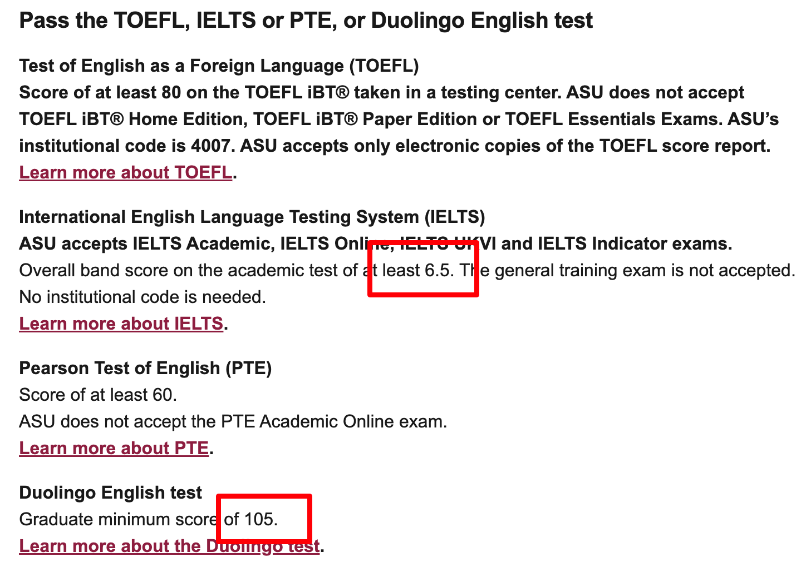
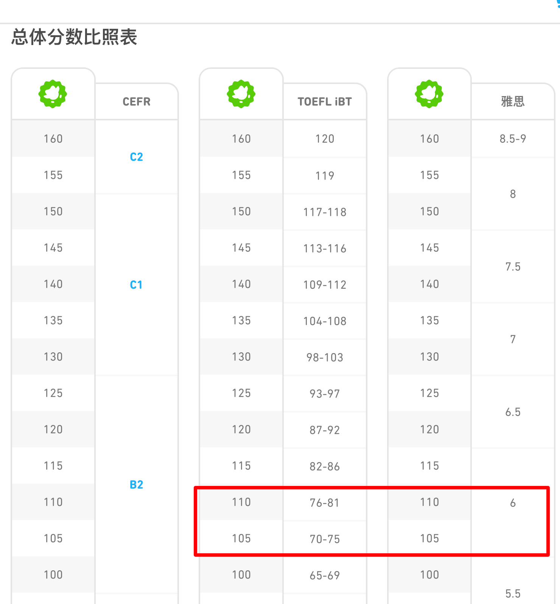
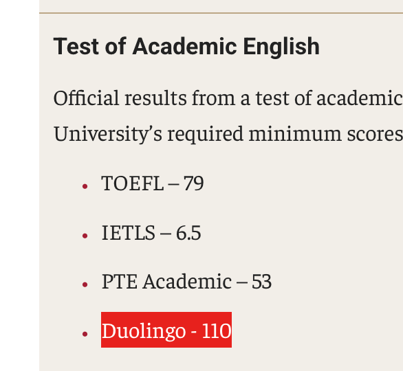

# phd-admission
本项目基于 https://creativecommons.org/licenses/by-nc-sa/4.0/ 协议

# 1. 谁适合阅读
本文主要适合计算机学生。其他专业的学生也OK，有很多规则、流程都是通用的，希望能给所有人带来一些启发性的指导

# 2. Why phd
拆分成两个问题

1. Why PhD？  
这可能更多是自己的选择，学术道路或是缓解就业压力？

2. Why USA PhD？  
对于计算机学生来说，美国或许上限更高，学术环境更好，平时也会有相比国内稍显体面的工资；但是离家远，需要自己克服

# 3. 政策风险
1. 中美关系近几年不太良好
2. Trump上台砍经费，主要涉及生物/化学/医学/DEI(diversity, equity, and inclusion 多元 平等 包容)
3. F1大概率要经历221(g)条例的签证审查，大概要被审查40-50天，最后还只能拿到一年签证。并且自Trump上台后，出台的很多政策都在拿留学生开刀。
4. 理工科学生一旦到美国，由于一年签证问题，几乎无法离境，四五年内只能在美国呆着

具体例子：
1. 2020年5月，Trump签署第10043号总统公告  
2. 2025年上半年，Trump上台后，砍科研经费，主要涉及医学/生物/化学等领域
3. 2025年6月初，大使馆直接暂停了F1类留学签证的面签预约，直接导致众多留学生的签证审查时间延长两周
4. 2025年6月中旬，面签重新开启后，大使馆加强了留学生的社交媒体审查，留学签证申请难度进一步加大，签证审查时间进一步拉长

Open Question：万一风浪越大鱼越贵，现在是抄底/去美国的机会吗？

# 4. 个人背景

## 4.1 学历

本科or硕士都能申请，本科在申请时也就是直博。

美国学校在申请博士时，对于学历没有强制性要求，硕士能申请的博士项目，本科也能申请。

但是教授可能更青睐有硕士学历的，case by case

## 4.2 GPA 标化成绩

美国相比国内，会略微关注GPA。标化成绩肯定是越高越好，能体现出对于学习的认真的态度，但也并不意味着低GPA就申不上博士；高GPA也不一定就能申请上，美博申请略带玄学，不是申请的决定性因素

英语成绩单：本科已经毕业的，可以找本科教务处/档案馆开

## 4.3 学术能力/实习

论文：  
因人而已的申博因素，论文等级越高越好，尽自己努力多拿一作吧

论文也分等级，国内认CCF评级/SCI；国外期刊看JCR，会议的话看圈子。一般国内认的CCF会议美国也认，但是美国会议评级不会划分的非常清晰

实习：  
开发实习/算法实习/暑研 这三类我都算是实习的类别。开发和算法实习就看自己能力或者导师给不给放假出去实习了，同样是越多越好了；暑研可能不太好找，而且一般都是unpay的，如果执意要申博，一段有产出的暑研当然非常不错

## 4.4 国际生标化成绩强制要求

英语是最基本的门槛，国际生必须要有，建议尽早考出成绩，通过学校要求即可

强制：  
几乎所有的美国学校都接受雅思(IELTS)和托福(TOEFL)，也有很多学校接受多邻国考试(DET)  

雅思为线下考试，考一次约2200RMB；  
托福为线下考试，考一次约2000RMB；  
多邻国为线上考试，考一次约400RMB(70美刀，但是找第三方平台可以买考试邀请码，会更便宜一点)  

选择：  
GRE，但是现在很多学校不强制要求，可以不用提交

一般最低要求：  
雅思：一般总分6.5，小分6.0或者5.5  
托福：80  
Duolingo：105  

机会：  
绝大多数学生都是考雅思或托福，但是多邻国考试在美国很多学校也认，并且有可能分数要求比雅思还会低一点点，会极大的方便自己、节省时间

例子1：  
Arizona State University(USNEWS 121 National)，其2025Fall的国际生英语标准可在 https://admission.asu.edu/apply/international/graduate/english-proficiency 查看。雅思要求为6.5，多邻国要求为105，而根据多邻国官方成绩对照表可知，多邻国105仅对应雅思6.0的水平，降低了对考生的英语要求。

例子2：  
Temple University(USNEWS 98 National)，英语要求在 https://grad.temple.edu/admissions/international-applicants/required-application-documents 查看。多邻国110对应雅思6.0的水平，同样降低了对英语的要求。

# 5. 博士奖学金

## 5.1 开销
绝大多数美国博士项目都是全奖（免学费保险费，再发一笔工资），因学校，因地区而已，工资能够保证基本生活。

大部分学校的PhD工资可在 https://www.phdstipends.com 查看，但是里面的数据可能不太准，而且现在美国通货膨胀有点严重，物价一直在涨，最好还是问问之前的学生来确定一下

## 5.2 奖学金类别 TA/RA/Fellowship

1. TA(Teaching Assistantship): 主要职责是给本科生批改作业之类的辅助教学类工作，学院会负责大部分的工资发放
2. RA(Research Assistantship): 给导师打工，做研究类项目/论文之类的工作，主要由导师来发工资
3. Fellowship：外籍学生很难申，主要给学校本国的phd学生，中国学生申美国phd基本不用想了

TA和RA类型的工资都要交税，不过中国人在美国有5000的免税额度。Fellowship交不交税好像得看学校要求

## 5.3 全奖和CSC区别

1. 全奖, 对方学校或导师出钱，只要拿到，对学生本人限制很少
2. CSC, 由中国留学基金委出钱，博士毕业后必须回国服务

理工科不要幻想走CSC方式去美国读博了，由于中美关系紧张，基本不可能下签证